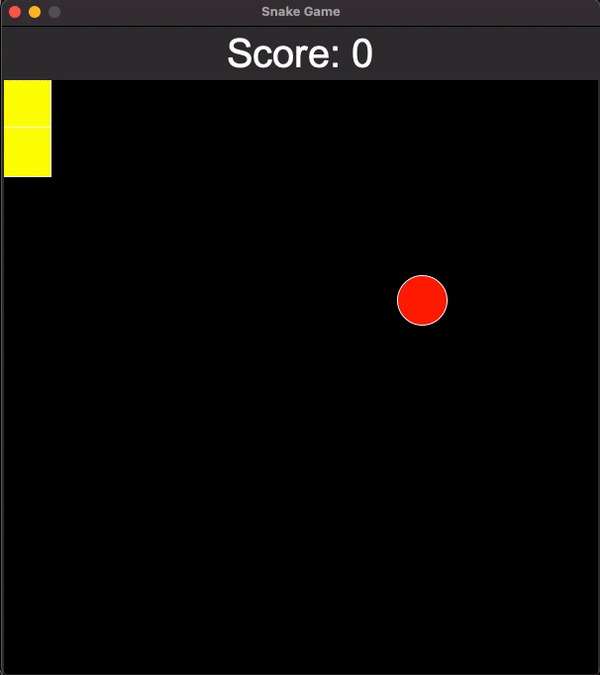

# Snake Game

Control your "snake" to eat as much food as possible before running into the border or yourself!

This game was made with Python.

## Demo



## How to Play

* Use the arrow keys to maneuver your snake in all directions around the board.
* Every time a food item is eaten, the snake grows an extra block in size.
* You can press ESC at any point to quit the game

## Installation
### Windows

Open Command Prompt and run the following:

```sh
pip install tk
```

### Mac

Open Terminal and run the following:

```sh
pip install tk
```

### Linux

Debian / Ubuntu

```sh
sudo apt-get install python3-tk
```

Arch

```sh
sudo pacman -S python-tk
```

Fedora

```sh
sudo dnf install python3-tkinter
```

# Python-arcade
